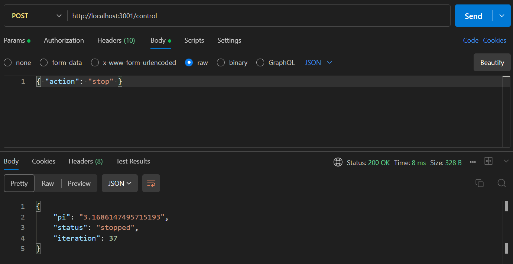

# Naluri Space Pi

A Node.js backend service that calculates the value of **π (pi)** using the **Leibniz formula** and exposes endpoints to control and monitor the calculation process.

The goal: Provide a Pi value for computing circumferences of celestial bodies (Sun, Earth, Moon), following the BDD requirements in the assessment.

---

## **Project Overview**

* Language: **JavaScript (Node.js)**
* Framework: **Express.js**
* Persistence: **JSON file (state.json)**
* Calculation Formula: **Leibniz series**

  $$
  \pi = 4 \sum_{k=0}^{\infty} \frac{(-1)^k}{2k+1}
  $$

---

## **Features**

* Start, pause, stop, and reset calculation via `/control` endpoint.
* View current status and computed pi via `/status` endpoint.
* State persistence across restarts (auto-resume if status is running).
* BDD-compliant behavior for `stop` vs `pause` vs `reset`.

---

## **Project Structure**

```
project-root/
├── src/
│   ├── services/
│   │   └── piCalculatorServices.js      # Leibniz calculation logic
│   ├── utils/
│   │   └── stateManager.js              # Read/write state.json
│   └── config/
│       └── index.js                     # App configuration
├── state/
│   └── state.json                       # Persistent state
├── docs/
│   └── screenshots/                     # Screenshots of test evidence
├── server.js                            # Express server entry point
├── .gitignore
├── .nodemonignore
├── package-lock.json
├── package.json
└── README.md
```

---

## **Installation & Setup**

### 1. Clone the Repository

```bash
git clone https://github.com/hrluqman/naluri-space-pi.git
cd naluri-space-pi
```

### 2. Install Dependencies

```bash
npm install
```

### 3. Development with Auto-Restart (nodemon)

```bash
npm run dev
```

### 3. Start in Production Mode

```bash
npm start
```

---

## **API Endpoints**

### **GET** `/status`

**Description:** Returns current pi value, status, and iteration.

**Response Example:**

```json
{
  "pi": "3.14159",
  "status": "running",
  "iteration": 1200
}
```

### **POST** `/control`

**Description:** Accepts an `action` in the JSON body to control calculation.

| Action  | Description                             |
| ------- | --------------------------------------- |
| `start` | Start calculation (or resume if paused) |
| `pause` | Pause calculation                       |
| `stop`  | Stop calculation (next start = reset)   |
| `reset` | Immediately reset to initial state      |

**Request Example:**

```json
{ "action": "start" }
```

**Response Example:**

```json
{
  "pi": "3.0418396",
  "status": "running",
  "iteration": 10
}
```

---

## **Testing with Postman**

### 1. **Start Calculation**

* Method: **POST**
* URL: `http://localhost:3001/control`
* Body (raw, JSON):

```json
{ "action": "start" }
```

**Example Screenshot:**


---

### 2. **Pause / Stop / Reset**

Send POST to `/control` with:

```json
{ "action": "pause" }
{ "action": "stop" }
{ "action": "reset" }
```

**Example Screenshot:**


---

### 3. **Check Status**

* Method: **GET**
* URL: `http://localhost:3001/status`

**Example Screenshot:**


---

## **How the Calculation Works**

* Each iteration computes one term of the Leibniz series: `(-1)^k / (2k+1)`.
* The sum is multiplied by 4 to get the current approximation of π.
* Progress is saved to `state.json` after each iteration for persistence.

---

## **Scripts**

```json
"scripts": {
  "dev": "nodemon server.js",
  "start": "node server.js"
}
```

---

## **Future Enhancements**

* Migrate from JSON file to Redis or database for state persistence.
* Further classify components into domain-based modules.